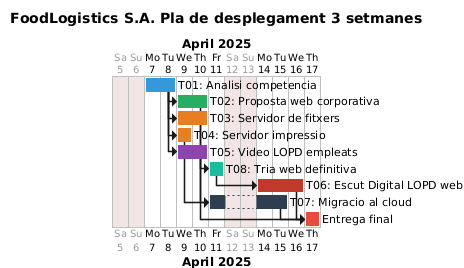

# Presentació Personal

**Nom:** Christian Bogdanas
**Curs:** 2n de SMX
**Data:** 29/05/2026

> Em dic Christian Bogdanas, tinc 18 anys. He finalitzat el Grau de Sistemes Microinformàtics i Xarxes a l'Escola Pia Santa Anna. Soc un noi molt apassionat al món de la tecnologia, la informàtica i els esports com la natació.
---

## Índex

1. [Perfil de GitHub](#perfil-de-github)
2. [Anàlisi de Projectes](#anàlisi-de-projectes)
3. [Defensa Tècnica](#defensa-tècnica)
4. [Metodologia de Treball](#metodologia-de-treball)
5. [Conclusions i Aprenentatges](#conclusions-i-aprenentatges)

---

## Perfil de GitHub

🔗 **Perfil:** [github.com](https://github.com/0NotCris0)

### README del Perfil
> Els punts principals del meu README són una explicació breu dels meus coneixements, del que estic treballant i del que estic aprenent.

### Estructura General del Perfil
> L'estructura general del meu perfil ha estat molt simple; he intentat organitzar els repositoris per projectes, amb una descripció clara de cadascun i enllaços als README detallats. També he mantingut una activitat regular amb commits i actualitzacions.

### Repositoris Principals

| Repositori | Descripció | Estat |
|------------|------------|-------|
| [Projecte 02](https://github.com/0NotCris0/Projecte2) | Creació i creixement d’EverPia, una consultora IT enfocada a resoldre reptes tecnològics i ajudar empreses i persones a evolucionar | ✅ |
| [Projecte 03](https://github.com/0NotCris0/Projecte3) | Simulació d’una empresa IT en expansió on cal gestionar incidències, servidors i problemes derivats del creixement | ✅ |
| [Projecte 04](https://github.com/0NotCris0/Projecte4) | Projecte final orientat a demostrar les competències professionals adquirides: treball en equip, documentació, investigació i resolució de problemes | ✅ |
| [Projecte 05](https://github.com/0NotCris0/projecte5) | Disseny inicial d’una proposta de negoci IT B2B, centrant-se en la definició tècnica i l’estructura de la solució | ✅ |
| [Projecte 06](https://github.com/0NotCris0/projecte6) | Desenvolupament d’una plataforma E-learning amb una infraestructura de servidor eficient, sostenible i adaptada a una PIME | ✅ |
| [Projecte 07](https://github.com/0NotCris0/projecte7) | Modernització de la infraestructura informàtica d’una empresa logística per millorar seguretat, comunicació i continuïtat del negoci | ✅ |
| [Projecte 08](https://github.com/0NotCris0/projecte8) | Consultoria tecnològica per ajudar una PIME en la seva transformació digital de manera eficient i sostenible | ✅ |

---

## 📊 Metodologia de Treball

### Fases del projecte

Hem treballat amb diferents eines i metodologies al llarg dels projectes.

### Tauler Kanban

| 📝 Pendent | 🔄 En curs | 🔍 En revisió | ✅ Finalitzat |
|-----------|-----------|--------------|--------------|
| | | | |

- [Kanban](https://planner.cloud.microsoft/webui/myplans/recent?tid=c7b5981a-7820-4ac8-ae65-03515ea81317)

### Diagrama de Gantt

### GitHub com a eina de seguiment

---

## Conclusions i Aprenentatges

